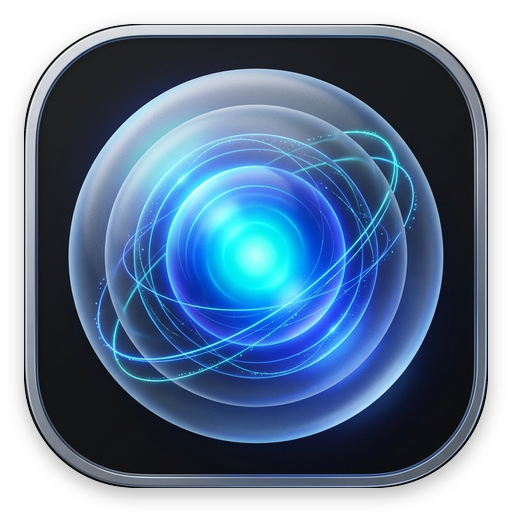

<div align="center">



# TouchAssistBall (触屏桌面悬浮球)

**A high-performance, zero-intrusive, fully customizable assistive floating ball for Windows touch & tablet devices.**  
**专为 Windows 触屏与二合一设备打造的高性能、零焦点打扰、全键位自定义桌面辅助悬浮球。**

[](https://github.com/spurbro/TouchAssistBall/releases/latest)
[](https://github.com/spurbro/TouchAssistBall/releases)
[](https://www.microsoft.com/windows)
[](https://dotnet.microsoft.com/)
[](https://learn.microsoft.com/dotnet/csharp/)
[](LICENSE)
[](https://github.com/spurbro/TouchAssistBall/pulls)

<br/>

[📥 **Download Latest Release (最新正式版下载)**](https://github.com/spurbro/TouchAssistBall/releases/latest)

[English](#-english) • [简体中文](#-简体中文)

</div>

---

## 🌐 English

### 💡 Overview
**TouchAssistBall** is an ultra-lightweight, hardware-accelerated assistive touch ball specifically engineered for Windows touchscreen devices (Microsoft Surface, 2-in-1 laptops, rugged tablets). Built with pure C# and WPF Direct3D/DWM compositing, it provides an intuitive floating touch controller with zero focus stealing, instant typing input detection, radial gestures, and deep idle transparency.

### 📥 Direct Downloads

| Package | Description | Direct Link |
| :--- | :--- | :--- |
| 📦 **Full Portable Package (v1.2.0 Latest)** | Complete ZIP with assets, config and docs | [**TouchAssistBall-v1.2.0.zip**](https://github.com/spurbro/TouchAssistBall/releases/download/v1.2.0/TouchAssistBall-v1.2.0.zip) |
| 🚀 **Standalone Executable (v1.2.0 Latest)** | Single standalone green `.exe` file (zero installer) | [**TouchAssistBall.exe**](https://github.com/spurbro/TouchAssistBall/releases/download/v1.2.0/TouchAssistBall.exe) |
| 📦 *v1.0.0 Stable Release* | Legacy release package | [*TouchAssistBall-v1.0.0.zip*](https://github.com/spurbro/TouchAssistBall/releases/download/v1.0.0/TouchAssistBall-v1.0.0.zip) |

> Requires Windows 10/11 with .NET Framework 4.0 or higher (pre-installed by default on Windows).

### ✨ Key Features

- **🛡️ Zero Focus Stealing (`WS_EX_NOACTIVATE`)**: Clicking, dragging, or swiping the ball never deactivates or steals focus from underlying foreground windows (Word, Edge, VS Code, WeChat, etc.).
- **🌟 4-Sector Annular Radial Menu**: Long-pressing or swiping outward gracefully unfolds a fluid 4-sector circular HUD ring with $3^\circ$ laser gaps, two-line action badges, and key hints.
- **⚡ 120 FPS High-Refresh Animation**: 160ms/120ms `CubicEase` micro-transitions with zero-allocation frozen brushes and decoupled layout passes.
- **📸 Screenshot Auto Flash-Hide**: Automatically hides the floating ball within 20ms during screenshots (both ball gesture actions and physical `PrintScreen` / `Win+Shift+S`), keeping all screenshots 100% clean.
- **🚀 Single-Instance Instant Wake-Up**: Double-clicking the shortcut when already running immediately wakes, restores, and brings the floating ball to the top.
- **👻 Smart Idle Auto-Fade**: Automatically fades into a subtle 22% translucent glass state after 5 seconds of inactivity to eliminate screen occlusion. Instantly awakens to 100% upon the lightest touch.
- **🎯 Intelligent Input Field Sensing**: Actively detects text caret/input focus without UI thread blocking. Automatically switches to backspace mode (`⌫`) when typing and remains passive when browsing.
- **⚡ Hardware-Grade Typematic Auto-Repeat**: Long-pressing the ball in an input field triggers continuous rapid keystrokes (250ms initial delay, followed by 55ms rapid pulse rate) for smooth deleting.
- **🧭 True Radial 4-Direction Gestures**: Swipe out from the center in any direction to trigger assigned actions:
  - 👈 **Swipe Left**: Copy (`Ctrl + C`)
  - 👉 **Swipe Right**: Paste (`Ctrl + V`)
  - 👇 **Swipe Down**: Screenshot Snipping (`Win + Shift + S`)
  - 👆 **Swipe Up**: Custom Action / Enter (`Ctrl+1` / `Enter`)
  - 🔄 **Center Deadzone Cancel**: Drag back into the center dashed ring to cancel cleanly.
- **🎮 100% Free Key Remapping**: Bind any action to custom keyboard shortcuts (including `Win+Shift+S`, `Ctrl+Shift+Esc`, `Alt+F4`, `Ctrl++`, modifier keys, and media navigation).
- **🧲 Free Anywhere Hover (Zero Edge Snapping)**: Complete freedom of positioning anywhere on single or multi-monitor setups without forced edge-docking.
- **🖊️ Surface Stylus & Pen Compatible**: Seamlessly supports touch screen fingers, electromagnetic digitizer pens, and standard mice.

### 🚀 Quick Start

1. Download [`TouchAssistBall-v1.2.0.zip`](https://github.com/spurbro/TouchAssistBall/releases/download/v1.2.0/TouchAssistBall-v1.2.0.zip) or [`TouchAssistBall.exe`](https://github.com/spurbro/TouchAssistBall/releases/download/v1.2.0/TouchAssistBall.exe).
2. Double-click `TouchAssistBall.exe`.
3. The assistive ball appears on your screen and the notification tray icon is activated.
4. **Move the Ball**: Rapid double-tap, then hold and drag on the 2nd tap (or right-click the ball/tray and select "Drag Position").
5. **Open Settings**: Right-click the floating ball, or double-click the system tray icon to configure custom keys, gesture thresholds, and idle timers.

### 🛠️ Building from Source

No heavy Visual Studio installation required! Build in 2 seconds using the built-in Windows .NET Framework compiler:

```cmd
# Clone repository
git clone https://github.com/spurbro/TouchAssistBall.git
cd TouchAssistBall

# Build standalone executable with embedded app icon
build.bat
```

---

## 🇨🇳 简体中文

### 💡 项目简介
**TouchAssistBall (触屏桌面悬浮球)** 是专为 Windows 触控屏设备（微软 Surface、二合一笔记本、工控触控平板）量身打造的高性能、低延迟、零焦点抢占的桌面手势增强助手。基于原生 C# 与 WPF Direct3D/DWM 硬件加速图层构建，完美融合现代 Windows 11 Fluent 视觉与极致顺滑的指尖操控。

### 📥 快速下载

| 发布类型 | 说明 | 极速直链下载 |
| :--- | :--- | :--- |
| 📦 **完整便携包 (v1.2.0 最新正式版)** | 包含主程序、配置、高清图标与完整文档 | [**TouchAssistBall-v1.2.0.zip**](https://github.com/spurbro/TouchAssistBall/releases/download/v1.2.0/TouchAssistBall-v1.2.0.zip) |
| 🚀 **单文件绿色版 (v1.2.0 最新正式版)** | 独立绿色单文件执行程序，解压即用 | [**TouchAssistBall.exe**](https://github.com/spurbro/TouchAssistBall/releases/download/v1.2.0/TouchAssistBall.exe) |
| 📦 *v1.0.0 稳定版归档* | 历史版本安装包备份 | [*TouchAssistBall-v1.0.0.zip*](https://github.com/spurbro/TouchAssistBall/releases/download/v1.0.0/TouchAssistBall-v1.0.0.zip) |

> 适用系统：Windows 10 / Windows 11（依赖 .NET Framework 4.0+，Windows 系统均已原生内置，开箱即用）。

### ✨ 核心特性

- **🛡️ 免激活防抢焦点（`WS_EX_NOACTIVATE`）**：在文档、浏览器、终端或聊天软件中，触碰悬浮球绝不夺取焦点，当前文本光标位置 100% 保持原样。
- **🌟 4 扇区环形外展圆盘**：长按小球或向外滑动时，优雅展开四向环形外展大圆盘，均分为 4 个扇形区域并呈现 $3^\circ$ 激光微缝与动态指示徽标，直观清晰。
- **⚡ 120 FPS 丝滑微动效**：160ms/120ms `CubicEase` 物理缓动微动效，采用纯矢量冻结画刷与分层解耦渲染，彻底告别掉帧与性能消耗。
- **📸 截屏自动无痕闪隐避让**：触发截屏（不管是手势下滑触发还是敲击物理键盘 `PrintScreen` / `Win+Shift+S`），悬浮球在 20ms 内自动瞬间闪隐，确保截屏画面 100% 纯净无球体残留。
- **🚀 单实例即时唤醒置顶**：当程序已在后台常驻时，再次双击桌面图标会立即通过系统级事件通道唤醒悬浮球置顶并激活可见，杜绝误判“打不开”。
- **👻 自动闲置深度淡化防遮挡**：停止操作 5 秒后，悬浮球通过平滑缓动动画淡化至 **22% 磨砂超低不透明度**，彻底杜绝视线遮挡；指尖轻触瞬间 100% 满血亮起。
- **🎯 智能输入框感知**：智能探查当前前台光标状态，位于输入框时光标球亮起并变为 `⌫` 退格标识，非输入框时保持静默防误触。
- **⚡ 硬件级连续击键脉冲（Typematic Repeat）**：长按退格键时模拟真实键盘重复逻辑（初始 250ms 延迟，随后以 55ms 频率连续输入退格，抬手即停），连删极为跟手顺畅。
- **🧭 几何中心真球心四向手势**：
  - 👈 **往左滑**：复制 (`Ctrl + C`)
  - 👉 **往右滑**：粘贴 (`Ctrl + V`)
  - 👇 **往下滑**：系统截屏 (`Win + Shift + S`)
  - 👆 **往上滑**：自定义操作 / 回车换行 (`Ctrl+1` / `Enter`)
  - 🔄 **中途防误触撤销**：滑动中途拉回中心虚线圆环松手即可取消触发。
- **🎮 100% 自由按键映射**：支持任意组合键（如 `Ctrl+Alt+A`、`Ctrl+Shift+Esc`、`Win+D`、`Ctrl++`、左右修饰键区分），支持键盘一键录制与触屏虚拟按键助手。
- **🧲 全屏自由就地悬停（彻底删除强制贴边）**：拖拽到屏幕任意角落松手即停，支持多显示器跨屏拖拽，四周留出充足手势交互空间。
- **🖊️ Surface 手写笔与触控屏深度兼容**：原生区分手指电容触控与电磁手写笔（Stylus），数位板笔尖点击与拖拽不再失灵。

### 📋 默认手势对照表

| 触发操作 | 场景 | 默认执行动作 | 说明 |
| :--- | :--- | :--- | :--- |
| **轻点一下 (Tap)** | 输入框内 | 退格删除 (`Backspace`) | 0 延迟即点即删，可自定义 |
| **轻点一下 (Tap)** | 非输入框 | 静默无动作 | 杜绝平时误触 |
| **长按保持 (Hold)** | 输入框内 | 硬件级连续退格 | 55ms 高频重复脉冲，抬手即止 |
| **长按展开 (Long Press)**| 全局 | 展开 4 扇区外展圆盘 | 实时预览四向功能与高亮选中 |
| **左滑动 (Swipe Left)** | 全局 | 复制 (`Ctrl + C`) | 划向左扇区或划出边缘即触发 |
| **右滑动 (Swipe Right)** | 全局 | 粘贴 (`Ctrl + V`) | 划向右扇区或划出边缘即触发 |
| **下滑动 (Swipe Down)** | 全局 | 区域截屏 (`Win + Shift + S`) | 自动闪隐并呼出系统截屏工具 |
| **上滑动 (Swipe Up)** | 全局 | 自定义 / 换行 (`Ctrl+1` / `Enter`) | 划向上扇区即触发 |
| **双击并在第 2 下按住** | 全局 | ✥ 自由拖拽移动悬浮球 | 1:1 跟手移动，松开即就地停靠 |

### 🚀 运行与使用

1. **直接运行**：下载解压后双击 `TouchAssistBall.exe`（单文件绿色程序，零安装、零写入系统注册表）。
2. **移动位置**：
   - 方式一：快速轻点第 1 下，紧接着第 2 下按住变微标 `✥` 即可拖动；
   - 方式二：右键点击悬浮球，选择【✥ 拖动悬浮球位置】或【📍 重置位置到屏幕右侧】。
3. **个性化设置**：右键点击悬浮球选择【⚙ 设置】，或双击右下角任务栏托盘图标即可打开可视化设置面板。

### 🛠️ 源码极速构建

项目使用 Windows 自带的 .NET 4.0 `csc.exe` 极速单命令编译，无需配置大型 Visual Studio IDE：

```cmd
# 1. 克隆代码仓库
git clone https://github.com/spurbro/TouchAssistBall.git
cd TouchAssistBall

# 2. 执行编译批处理（自动内嵌 Gemini 设计应用图标）
build.bat
```

编译成功后将在根目录生成自带多分辨率系统图标的 `TouchAssistBall.exe`。

---

## 📂 Project Structure (项目目录结构)

```text
TouchAssistBall/
├── ActionExecutor.cs      # Win32 SendInput 硬件级按键模拟与脉冲连删
├── App.cs                 # 应用程序入口、任务栏托盘常驻与生命周期
├── AppConfig.cs           # 配置模型与 JSON 持久化管理
├── AppLogger.cs           # 轻量日志记录器（支持 1MB 自动轮转）
├── FloatingBallWindow.cs  # WPF Direct3D 悬浮球窗体、4扇区环形菜单与闲置动画
├── InputDetector.cs       # 智能前台窗口与文本输入焦点检测（防卡顿节流）
├── NativeMethods.cs       # Win32 原生 P/Invoke API 声明与按键轮询
├── SettingsWindow.cs      # WPF 全可视化按键自定义与触控外观设置面板
├── Tests.cs               # 包含 180 项自动化断言的单元测试套件
├── app.ico                # 包含 256x256 ~ 16x16 规格的 Windows PE 多分辨率图标
├── app.png                # 512x512 高清流体发光科技球图标
├── build.bat              # 一键编译脚本
├── config.json            # 用户按键映射与手势参数配置文件
└── README.md              # 中英文双语项目使用与开发文档
```

---

## 📝 Changelog / 版本更新记录

### 🚀 [v1.2.0] - 2026-09-05
#### Added (新增特性)
- **🌟 4 扇区环形外展 HUD 菜单 (Annular Radial Menu)**：
  - 长按小球或滑动时，顺滑展开 $R_{in}=36\text{px} \sim R_{out}=86\text{px}$ 的大圆盘。
  - 精确等分为上、下、左、右 4 个扇形区域，中间带有 $3^\circ$ 激光隔离缝隙。
  - 动态两行指示微标：图标/功能名称 + 当前绑定键位（如 `复制 (Ctrl+C)`、`截屏 (Win+Shift+S)`）。
  - 滑动指尖进入扇区即时高亮反馈，滑回中心虚线圆环安全取消。
- **📸 截屏自动无痕闪隐避让 (Screenshot Flash-Hide)**：
  - 手势下滑触发截屏动作时，悬浮球在 20ms 内先行瞬间隐匿，再下发 `Win+Shift+S`。
  - 全局 45ms 极速按键轮询侦测：用户直接按键盘物理 `PrintScreen` 键或按下 `Win+Shift+S` 瞬间，悬浮球立即主动闪隐 700ms 并在截屏完成后自动无感恢复。彻底杜绝截屏截到悬浮球。
- **🚀 单实例即时唤醒置顶通道 (Single-Instance Wake-Up)**：
  - 新增命名事件信号量 (`TouchAssistBall_WakeUp_Event`)。
  - 当程序已经在后台或托盘静默运行时，用户再次双击桌面图标不会再因为互斥体直接默默退出，而是立刻向主实例发出唤醒脉冲，悬浮球瞬间满血亮起并置顶显示。
- **🧪 自动化测试套件扩充**：
  - 单元测试增至 180 项断言，覆盖 4 扇区角度命中、边界临界值、连续脉冲安全机制与配置持久化。

#### Optimized & Fixed (优化与修复)
- **⚡ 120 FPS 高刷丝滑微动效**：
  - 展开与收起动画调整为 160ms/120ms `CubicEase`，微动效轻快灵动。
  - 移除导致内存与 GPU 合成开销的重型位图缓存（`BitmapCache`），改用纯矢量原生 Direct3D/DWM 硬件加速图层。
  - 预创建并全量冻结（`Freeze()`）常用渐变画刷与画笔，零 GC 垃圾回收压力。
- **🐛 跨平台与远程桌面兼容性修复**：
  - 修复此前引入 `SetWindowDisplayAffinity(0x11)` 导致 Windows on ARM 架构与网易UU远程桌面下 DWM 硬件图层不渲染、窗口完全隐形的问题。

---

### 📦 [v1.0.0] - 2026-09-04
#### Initial Release (首发正式版)
- **免激活防抢焦点**：基于 Win32 `WS_EX_NOACTIVATE` 实现悬浮交互零焦点夺取。
- **智能输入感知**：检测前台文本输入焦点，自动在退格模式与手势模式间切换。
- **硬件级连续退格**：250ms 初始防抖 + 55ms 高频重复脉冲。
- **四向真球心手势**：上、下、左、右独立按键映射及死区防误触。
- **全屏自由停靠**：彻底告别传统强制贴边停靠，支持任意屏幕位置与多屏拖拽。
- **可视化设置面板**：支持触控按键录制、滑动灵敏度微调与开机自启动设置。

---

## 📄 License

This project is licensed under the **MIT License** - see the [LICENSE](LICENSE) file for details.
